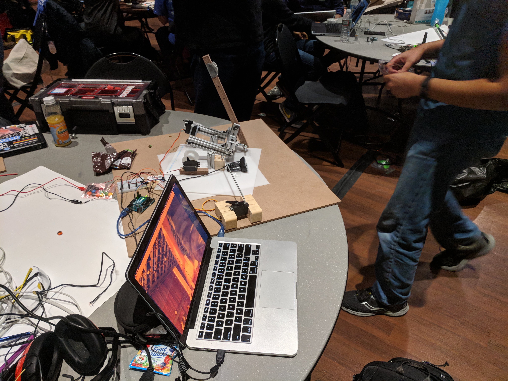

# dre

For MakeMIT 2018, we built a device to launch M&M's directly into your mouth.

## How we built it

### The Hardware

We use a spring-loaded catapult to launch the M&M. The catapult sits on a plate with two servos - one to control side to side motion, and the other to tilt it up and down. The device uses these two servos to take aim at an open mouth, and finally, a last servo actuates the release mechanism to fire.

The robot uses a Logitech webcam to sense where the user is, connected to a laptop via USB port. The laptop talks to an Arduino Uno over serial in order to send the servos commands.

### The Software

In order to detect the location of the face in the camera frame, we take advantage of the Microsoft Cognitive Services API. This API conveniently returns a bounding box around the face, from which we get the position of the user's mouth. Finally, we get the depth the user is at based on the size of this bounding box.

We've calibrated the device using multivariate interpolation in order to model its parabolic trajectory. This lets us get a decently accurate aim based off of this position.

## Pictures and Video Demo

TODO

## Challenges we ran into

Designing an effective, accurate shooting mechanism that auto-reloads is non-trivial - we ended up having to go through several iterations of designs, beginning with a barrel rifle system and ending with a spring loaded catapult. 

Additionally, we used a simple off-the-shelf Logitech webcam for our vision system. This meant that getting depth was a little tricky - we ended up using a method that used the bounding box of the detected face to compute a metric of depth.

## Improvements we'd like to make

The largest source of inaccuracy in the device comes from build quality of the device - since it was prototyped quickly, there's a decent amount of play and inconsistency in the joints between runs. We'd ideally like to rebuild it to minimize this.

Moreover, the launching mechanism can be much improved. We'd ideally like to use compressed air in the future, instead of a spring loaded system.

Finally, the software can be optimized quite a bit to speed up the aiming speed. Right now, we send uncompressed images to the API at a low rate, which can be sped up significantly.
